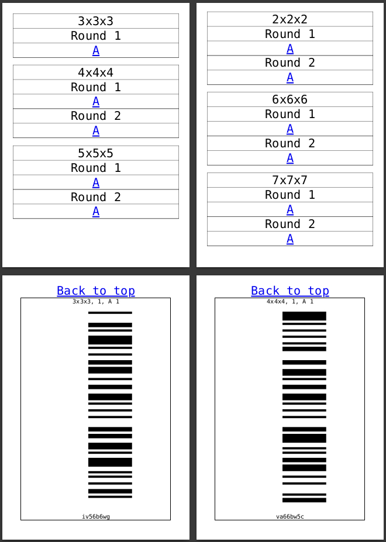
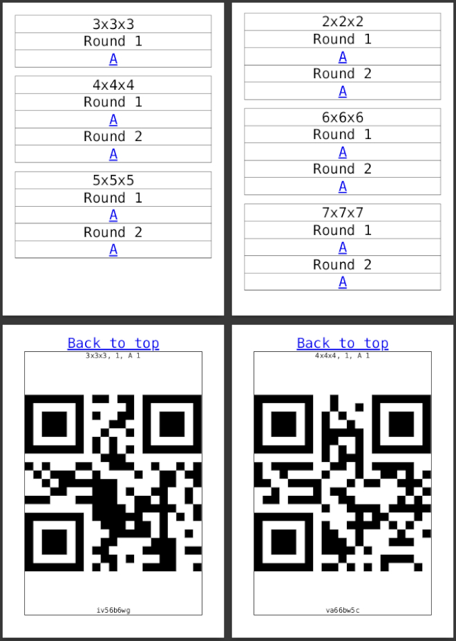
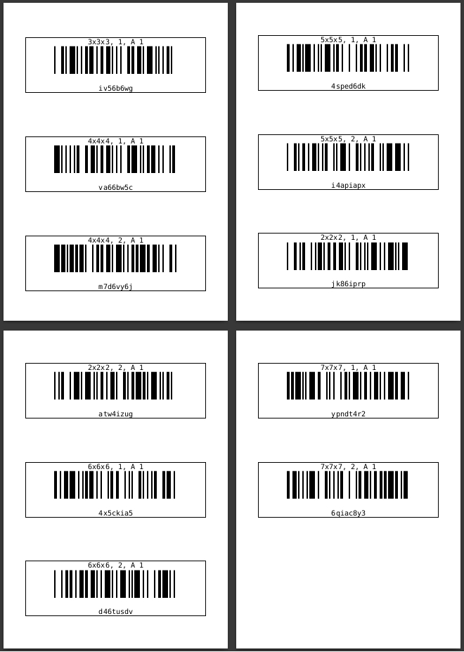
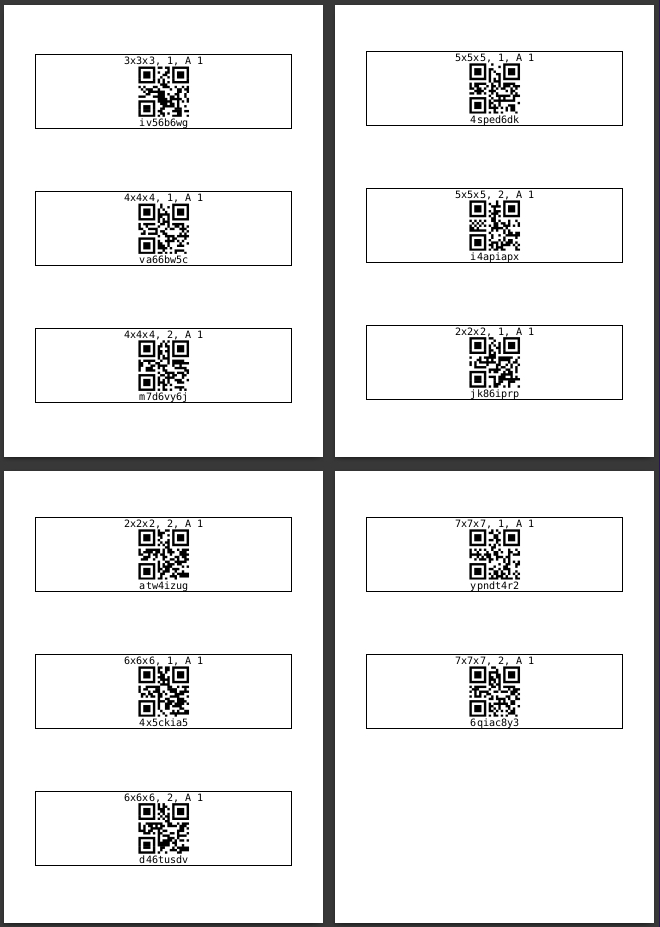

# tnoodle-barcode-pdf

Оффлайн-инструмент для генерации PDF с кодами, читаемыми сканером. Коды из этого PDF
используются для разблокировки скрамблов на станциях электронного скрамблинга.

На вход подаётся файл с паролями из tnoodle (WCA Competition Manager).
На выходе получаются два PDF с карточками кодов(штрихкод или QR-код)
для каждого набора скрамблов

## Скачать

Готовые сборки: [releases](https://github.com/SPEEDCUBES-TECH/tnoodle-barcode-pdf/releases)

Файлы сборки имеют имя `tnoodle-barcode-pdf-<version>-<platform>-<arch>.<ext>`.
Скорее всего вам нужна версия `win-x64` (`...win-x64.exe`).

## Использование

1. Выберите txt-файл с паролями (пример: [docs/example.txt](docs/example.txt)).
2. Задайте пароль (или сгенерируйте кнопкой с кубиком) - пустой пароль означает, что PDF не будет зашифрован.
3. Выберите тип кода: штрихкод или QR-код.
4. Нажмите `generate` и сохраните PDF:
   - `mobile` - страница на телефон: сначала оглавление, затем по клику - карточка с кодом
   - `print` - сетка карточек для печати

## Пример содержимого PDF

|        | barcode                                                    | qr                                               |
|--------|------------------------------------------------------------|--------------------------------------------------|
| mobile |  |  |
| print  |    |    |

## Сборка из исходников

```shell
npm install
npm run build-all     # сборка для всех платформ (linux/win, x64/arm64)
```

Отдельные цели:

- `npm run build-html` - сборка UI (`src/view`) в `src/view/build`;
- `npm run build-linux-x64` / `build-linux-arm64` / `build-win-x64` / `build-win-arm64` -
  сборка установщика для конкретной платформы;
- `npm start` - запуск приложения (`npm run serve` - dev-сервер UI для него).